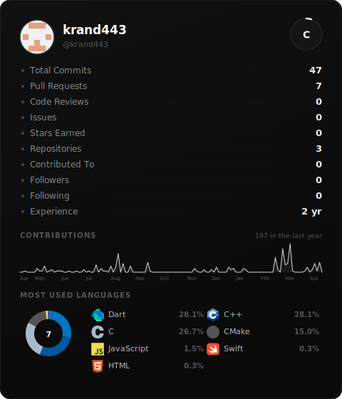
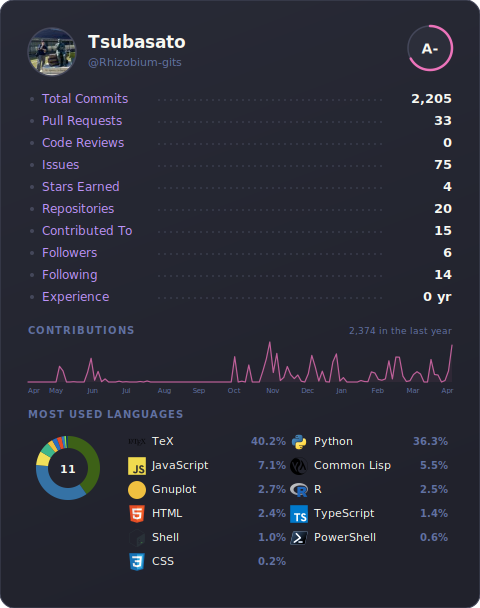
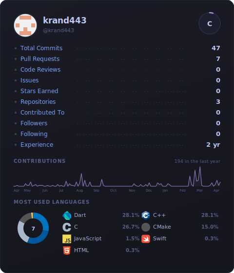
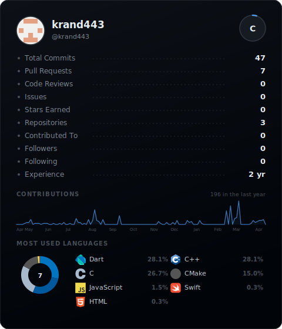
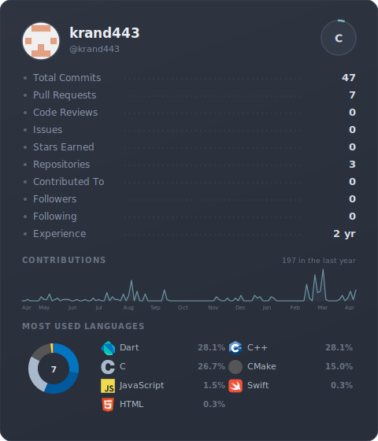
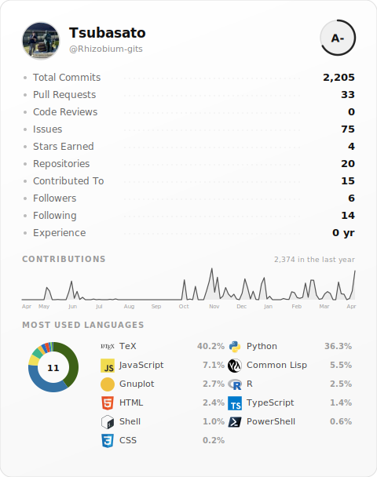

# GitHub Stats



### [English](#english) | [日本語](#japanese) | [中文](#chinese)

---

## English

### 3 Steps to Get Your Card

**Step 1.** Click **Fork** (top right of this page)

**Step 2.** Open `config.json` in your fork and change the username:
```json
{
  "username": "USERNAME"
}
```

**Step 3.** Add your GitHub token:
- Go to [github.com/settings/tokens](https://github.com/settings/tokens) → **Generate new token (classic)** → check `read:user` → copy token
- Go to your fork's **Settings** → **Secrets and variables** → **Actions** → **New repository secret**
- Name: `GH_TOKEN` / Value: paste your token

**Done!** Go to **Actions** tab → **Generate Stats Card** → **Run workflow**. All 32 themes will be generated in the `svg/` folder.

### Add to Your README

Pick a theme from the [preview page](https://rhizobium-gits.github.io/github-stats/) and paste:

```

```

Replace `USERNAME` with your GitHub username. Replace `noir` with any theme name below.

### Themes

| | | |
|---|---|---|
|  |  |  |
| `noir` | `dracula` | `tokyo-night` |
|  |  |  |
| `github-dark` | `nord` | `light` |

**All 32 themes:** `noir` `dracula` `one-dark` `monokai` `tokyo-night` `nord` `github-dark` `catppuccin` `gruvbox-dark` `solarized-dark` `synthwave` `cobalt` `ayu` `material-ocean` `rose` `night-owl` `palenight` `shades-of-purple` `panda` `horizon` `vitesse` `everforest` `kanagawa` `fleet` `light` `github-light` `solarized-light` `gruvbox-light` `catppuccin-latte` `light-owl` `everforest-light` `vitesse-light`

**[Preview all themes here](https://rhizobium-gits.github.io/github-stats/)**

---

## Japanese

### 3ステップでカードを作成

**ステップ 1.** このページ右上の **Fork** をクリック

**ステップ 2.** フォークした `config.json` を開いてユーザー名を変更:
```json
{
  "username": "USERNAME"
}
```

**ステップ 3.** GitHub トークンを追加:
- [github.com/settings/tokens](https://github.com/settings/tokens) → **Generate new token (classic)** → `read:user` にチェック → トークンをコピー
- フォークの **Settings** → **Secrets and variables** → **Actions** → **New repository secret**
- Name: `GH_TOKEN` / Value: コピーしたトークンを貼る

**完了!** Actions タブ → **Generate Stats Card** → **Run workflow** を実行。全32テーマが `svg/` フォルダに生成されます。

### README に追加

[プレビューページ](https://rhizobium-gits.github.io/github-stats/)でテーマを選んで貼り付け:

```

```

`USERNAME` を自分のユーザー名に、`noir` を好きなテーマ名に変えてください。

### テーマ

| | | |
|---|---|---|
|  |  |  |
| `noir` | `dracula` | `tokyo-night` |
|  |  |  |
| `github-dark` | `nord` | `light` |

**全32テーマ:** `noir` `dracula` `one-dark` `monokai` `tokyo-night` `nord` `github-dark` `catppuccin` `gruvbox-dark` `solarized-dark` `synthwave` `cobalt` `ayu` `material-ocean` `rose` `night-owl` `palenight` `shades-of-purple` `panda` `horizon` `vitesse` `everforest` `kanagawa` `fleet` `light` `github-light` `solarized-light` `gruvbox-light` `catppuccin-latte` `light-owl` `everforest-light` `vitesse-light`

**[全テーマをプレビュー](https://rhizobium-gits.github.io/github-stats/)**

---

## Chinese

### 3步获取你的卡片

**第1步.** 点击本页右上角的 **Fork**

**第2步.** 打开你 fork 的 `config.json`，修改用户名:
```json
{
  "username": "USERNAME"
}
```

**第3步.** 添加 GitHub 令牌:
- 打开 [github.com/settings/tokens](https://github.com/settings/tokens) → **Generate new token (classic)** → 勾选 `read:user` → 复制令牌
- 打开你 fork 的 **Settings** → **Secrets and variables** → **Actions** → **New repository secret**
- Name: `GH_TOKEN` / Value: 粘贴令牌

**完成!** 打开 **Actions** 标签 → **Generate Stats Card** → **Run workflow**。全部32个主题将生成在 `svg/` 文件夹中。

### 添加到 README

在[预览页面](https://rhizobium-gits.github.io/github-stats/)选择主题并粘贴:

```

```

将 `USERNAME` 替换为你的用户名，`noir` 替换为你喜欢的主题名。

### 主题

| | | |
|---|---|---|
|  |  |  |
| `noir` | `dracula` | `tokyo-night` |
|  |  |  |
| `github-dark` | `nord` | `light` |

**全部32个主题:** `noir` `dracula` `one-dark` `monokai` `tokyo-night` `nord` `github-dark` `catppuccin` `gruvbox-dark` `solarized-dark` `synthwave` `cobalt` `ayu` `material-ocean` `rose` `night-owl` `palenight` `shades-of-purple` `panda` `horizon` `vitesse` `everforest` `kanagawa` `fleet` `light` `github-light` `solarized-light` `gruvbox-light` `catppuccin-latte` `light-owl` `everforest-light` `vitesse-light`

**[预览全部主题](https://rhizobium-gits.github.io/github-stats/)**

---

## Tech Stack

| | |
|---|---|
| Card Generation | Node.js, SVG |
| CI/CD | GitHub Actions |
| Preview | [GitHub Pages](https://rhizobium-gits.github.io/github-stats/) |
| Data | GitHub REST API, GraphQL API |
| Icons | [devicons](https://github.com/devicons/devicon), [Simple Icons](https://github.com/simple-icons/simple-icons) |
| Rank | CDF Percentile |

## License

MIT
